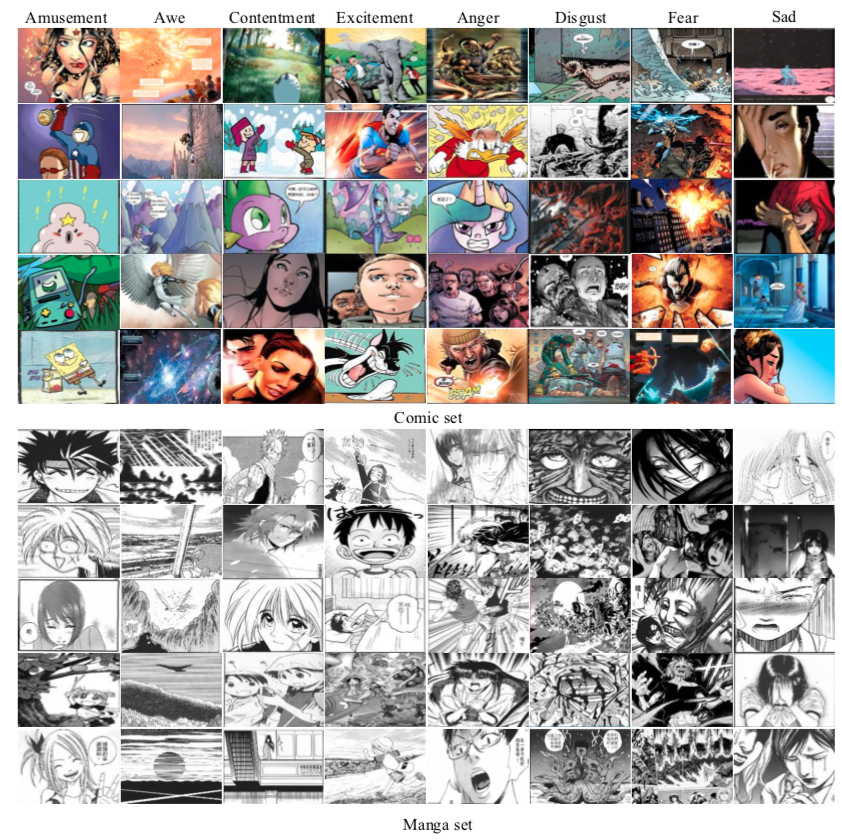

## Comics Dataset for Visual Sentiment Recognition

The Comics datset contains more than 10,000​ images belongs to 8​ categories. In specific, we use *Amusement, Awe, Contentment, Excitement* as positive sentiment, and *Anger, Disgust, Fear, Sadness* as negative sentiment. The images are collected from about seventy comics of various countries (e.g., America, Japan, China and France). About seventy comics are selected as candidates, e.g., Sponge Bob, Spiderman, The Avengers, One Piece, Slam Dunk, etc.  Finally, a total of 10,281​ comic images are selected and roughly divided into Comic subset and Manga subset.


###  File Structure

The Comics dataset can be downloaded from [Baidu](https://pan.baidu.com/s/12oqR1y4l-1Hf2_hQVtuecg) or [Google](https://drive.google.com/file/d/1nSFsFivyw3Et29cP_z_2Ta1qGSUEr_Sh/view?usp=sharing). The folders are arranged like this:

```
Comics
├── annotation
│   ├── test.txt
│   ├── train.txt
│   ├── trainval.txt
│   └── val.txt
├── images.zip
└── readme.md
```


### Class Examples




### Dataset Statistics

| Class     | Amusement | Awe  | Contentment | Excitement | Anger | Disgust | Fear | Sad  | Total |
| --------- | --------- | ---- | ----------- | ---------- | ----- | ------- | ---- | ---- | :---: |
| Comic set | 274       | 102  | 829         | 454        | 456   | 360     | 865  | 264  | 3604  |
| Manga set | 1220      | 327  | 1302        | 422        | 1128  | 388     | 1151 | 739  | 6677  |
| All       | 1494      | 429  | 2131        | 876        | 1584  | 748     | 2116 | 1003 | 10281 |

*The final version is slightly different from the paper.*


### Citation
If you find the Comics helpful, please cite it as
```
@article{She19sentiment,
  title={Learning Discriminative Sentiment Representation from Strongly- and Weakly-Supervised CNNs},
  author={Dongyu She, Ming Sun, Jufeng Yang},
  journal={ACM Transactions on Multimedia Computing, Communications, and Applications (TOMM)},
  year={2019},
  publisher={ACM}
}
```

ATTN: This dataset is free for academic usage. For other purposes, please contact Dongyu She (sherry6656@163.com).